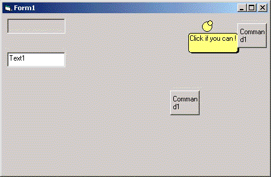



## Balloon Text  Pop Up

### Description

Create balloon pop ups simular to XP.

Dynamically creates the balloon by calling one function

The form has to have

4 Shape objects

And one label control

2 of the shape objects are used to make the balloon

1 the fore balloon

1 for the shadow

The other 2 make up the small circles

That lead up to the balloon

The label is contained in side the balloon and displays the text.

Very easy to do !

Example Use:

Make_ballon Picture1.Top, Picture1.Left, Picture1.Width, "Hello World Again, Still way cool !", 0

the zero determines which side to display

the balloon on 1 is for left 0 for right.

I forgot to add Pleaze Vote !

i would like to know.
 
### More Info
 
control.top

control.left

control.width

text to display

none known

             |
---                |---
**Submitted On**   |2003-03-26 13:51:52
**By**             |[GShuten](https://github.com/Planet-Source-Code/PSCIndex/blob/master/ByAuthor/gshuten.md)
**Level**          |Intermediate
**User Rating**    |4.3 (13 globes from 3 users)
**Compatibility**  |VB 4\.0 \(16\-bit\), VB 4\.0 \(32\-bit\), VB 5\.0, VB 6\.0
**Category**       |[Complete Applications](https://github.com/Planet-Source-Code/PSCIndex/blob/master/ByCategory/complete-applications__1-27.md)
**World**          |[Visual Basic](https://github.com/Planet-Source-Code/PSCIndex/blob/master/ByWorld/visual-basic.md)
**Archive File**   |[Ballon\_Tex1564773262003\.zip](https://github.com/Planet-Source-Code/gshuten-balloon-text-pop-up__1-44273/archive/master.zip)

